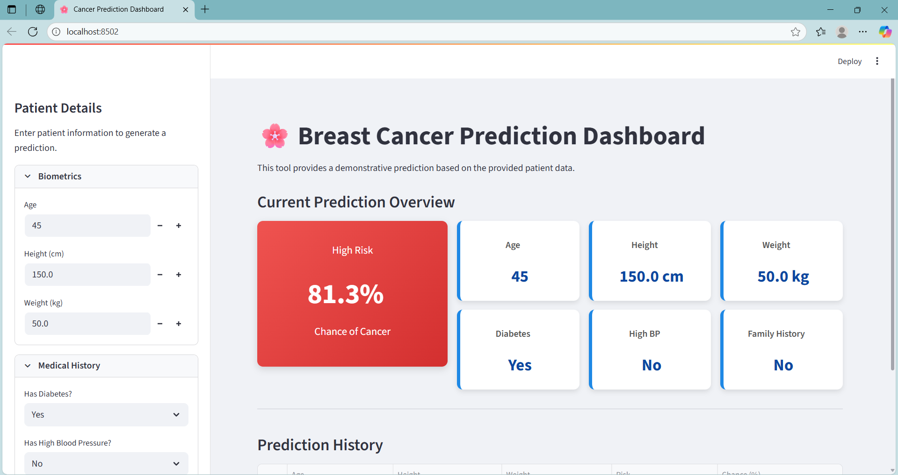
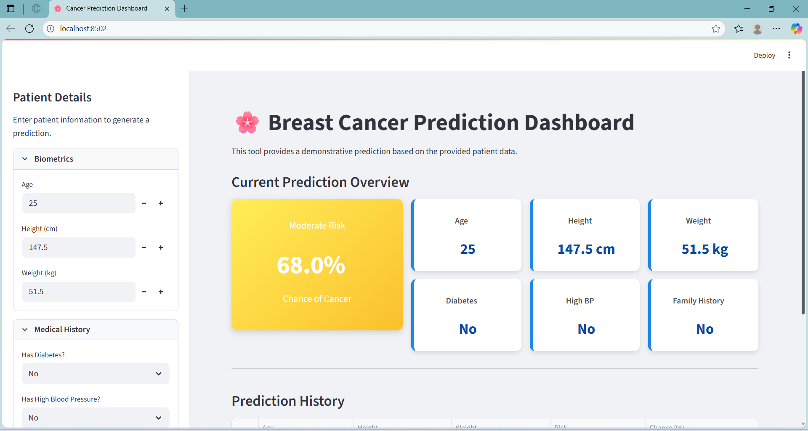
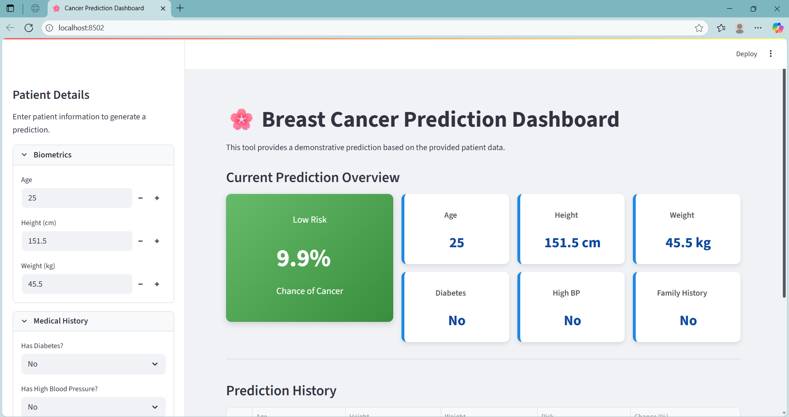
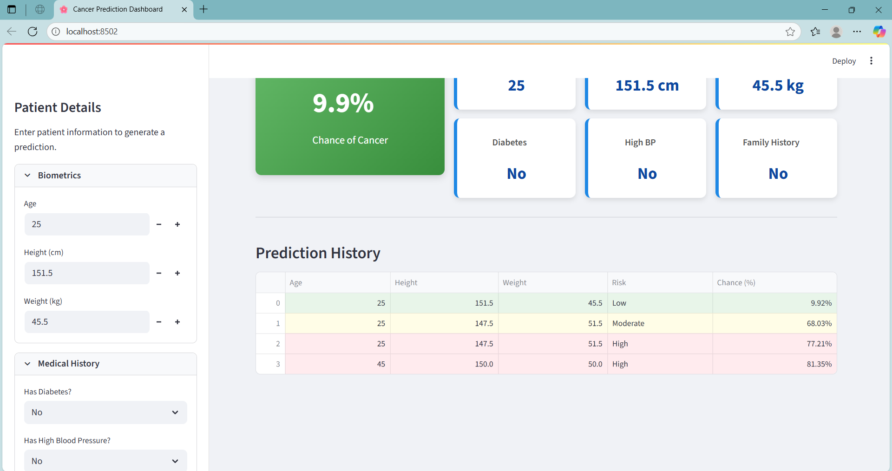

# 🌸 IntelliCancer Predict: A Breast Cancer Prediction Dashboard

A user-friendly web application built with Streamlit and Scikit-learn to predict breast cancer risk based on patient data. This project serves as a demonstration of applying machine learning in a healthcare context with a focus on a professional and interactive user interface.


## ✨ Key Features

-   **Real-Time Predictions**: Utilizes a Logistic Regression model to provide instant risk assessments.
-   **Interactive Dashboard**: A clean UI with a sidebar for inputs and a main panel for displaying results and patient data.
-   **Prediction History**: Logs the last 5 predictions with color-coded risk levels for easy comparison.
-   **Professional Styling**: Custom CSS for a modern, dashboard-like feel.


## 🛠️ Technology Stack

-   **Python**
-   **Streamlit** for the web interface
-   **Scikit-learn** for the machine learning model
-   **Pandas** for data handling
-   **NumPy** for numerical operations

## 📸 Screenshot






## 🚀 How to Run Locally

1.  **Clone the repository:**
    ```bash
    git clone [https://github.com/your-username/IntelliCancer-Predict.git](https://github.com/your-username/IntelliCancer-Predict.git)
    ```

2.  **Navigate to the project directory:**
    ```bash
    cd IntelliCancer-Predict
    ```

3.  **Install the required libraries:**
    ```bash
    pip install -r requirements.txt
    ```

4.  **Run the Streamlit app:**
    ```bash
    streamlit run app.py
    ```

## 📄 Disclaimer

This application is for educational and demonstrative purposes only. It is **not** a medical tool and should not be used for actual medical diagnosis.
